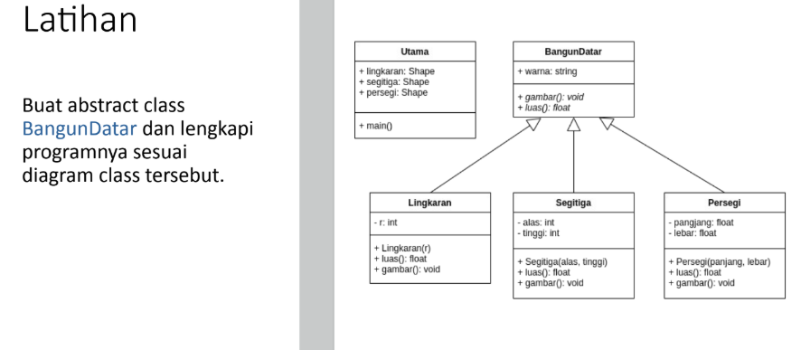
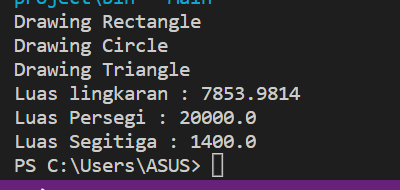

# Praktikum-6

<p> NAMA    : VIENA DWI PUTRI MAULINA<p>
<p> NIM     : 312110469 <p>
<p> KELAS   : TI.21.C1 <p>
<p> MATA KULIAH : PEMROGRAMAN ORIENTASI OBJEK <p>
<p>TUGAS PERTEMUAN 10<p>

<h4> SOAL <h4>



<h4> Jawab <h4>

<p> Shape.java <p>

```java
public abstract class Shape {
    String color;

    public String getcolor(){
        return this.color;
    }

    public void setcolor(String color){
        this.color = color;
    }

    public abstract void draw();
    public abstract float getAreas();
}
```

<p> Circle.java <p>

```java
public class Circle extends Shape{
    private float radius;

    public Circle(float radius){
        this.radius = radius;
    }
    
    @Override
    public void draw() {
        System.out.println("Drawing Circle");
    }

    @Override
    public float getAreas(){
        return (float)(Math.PI*radius*radius);
    }
}
```

<p> Triangle.java <p>

```java
public class Triangle extends Shape{
    private float base;
    private float height;

    public Triangle(float base, float height){
        this.base = base;
        this.height = height;
    }

    @Override
    public void draw(){
        System.out.println("Drawing Triangle");
    }

    @Override
    public float getAreas(){
        return this.base*height*1/2;
    }
}
```

<p> Rectangle.java <p>

```java
public class Rectangle extends Shape {
    private float height;
    private float width;

    public Rectangle(float height, float width){
        this.height = height;
        this.width = width;
    }

    @Override
    public void draw(){
        System.out.println("Drawing Rectangle");
    }

    @Override
    public float getAreas(){
      
        return this.width*this.height;

    }
}
```

<p> Main.java <p>

```java
public class Main {
    public static void  main(String[] args) {
        //membuat objek shape dari kelas rectangle
        Shape rect = new Rectangle(100, 200);

        //membuat objek shape dari kelas Cirle
        Shape circ = new Circle(50);

        //membuat objek shape dari kelas Triangel
        Shape tri = new Triangle(40, 70);

        //memanggil method draw
        rect.draw();
        circ.draw();
        tri.draw();

        System.out.println("Luas lingkaran : "+circ.getAreas());
        System.out.println("Luas Persegi : "+rect.getAreas());
        System.out.println("Luas Segitiga : "+tri.getAreas());
    }
}
```

<p> Output <p>

